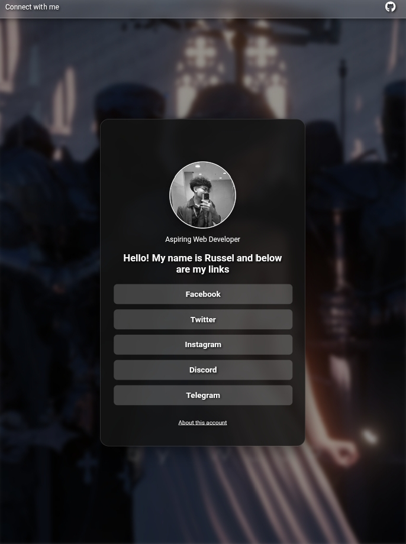
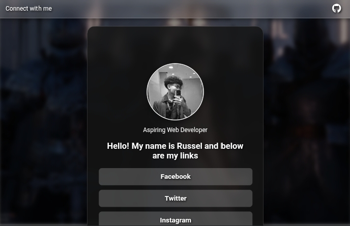
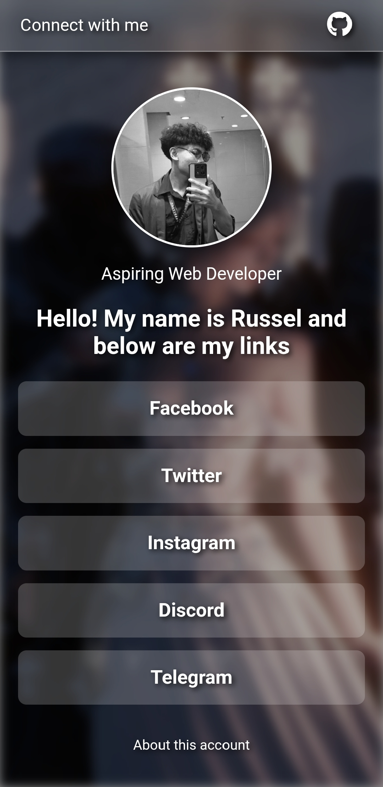

A modern, responsive LinkHub-inspired web application built with HTML, CSS, and JavaScript. This project focuses on creating a clean, visually appealing interface for organizing and sharing important links while showcasing front-end development skills.

📸 Screenshot

✨ Features

- Responsive design for desktop and mobile devices
- Clean and modern user interface
- Interactive animations and hover effects
- Organized link cards
- Fast and lightweight with vanilla JavaScript
- Smooth user experience

🛠️ Built With

- HTML5
- CSS3
- JavaScript (Vanilla JS)

🎯 Purpose

This project was created to practice and improve my front-end web development skills, particularly in responsive layouts, UI design, and JavaScript interactivity. It also serves as part of my personal portfolio to demonstrate my ability to build clean and functional web interfaces.

🚀 Getting Started

1. Clone the repository.
2. Open "index.html" in your browser.
3. Explore the application.

📌 Future Improvements

- Dark/Light mode toggle
- Additional animations
- Theme customization

👨‍💻 Author

Created by Russel Endico.
